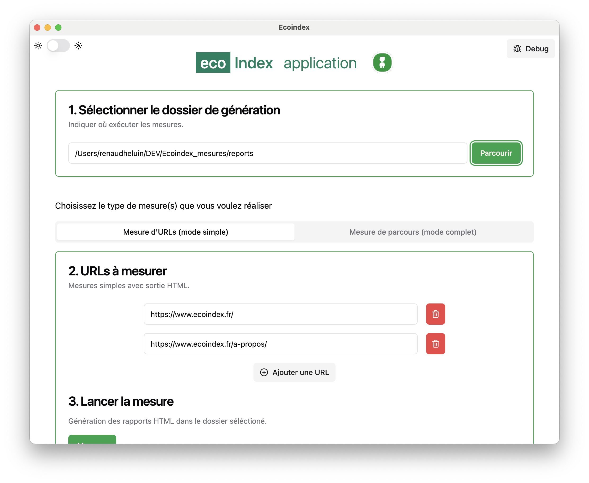

# Ecoindex-app

[Téléchargement de l'application](https://github.com/cnumr/EcoindexApp/releases/latest)
vous trouverez la version adaptée à votre ordinateur :

Plus d'informations sur le téléchargement.

-   **Linux**: ecoindex-app\_`{version}`\_amd64.deb
-   **Linux**: ecoindex-app-`{version}`-1.x86_64.rpm
-   **Windows** ecoindex-app-`{version}`-win32-x64-setup.exe
-   **Mac (M1)**: EcoindexApp-`{version}`-arm64.dmg
-   **Mac (Intel)**: EcoindexApp-`{version}`-x64.dmg

---

   
## Objectif de l'application

Cette application de bureau vous permet d'effectuer des mesures comme sur le site [econindex.fr](https://econindex.fr) , mais aussi d'avoir les mesures de lighthouse de Google, dans un seul et même rapport, sans limitation de mesures. 🎉

## Informations clés

Vous pouvez soit mesurer **une série d'URLs**, ou des **parcours de visite entiers**.
Cette version d'ecoindex fournit des mesures stables et cohérentes comme avec [econindex.fr](https://econindex.fr) ou [ecoindex-cli](https://github.com/cnumr/ecoindex_python_fullstack/blob/main/projects/ecoindex_cli/README.md).  
La gestion du cache du navigateur garantit des mesures **réalistes**.

Avec cette application, vous obtiendrez :

-   **Mesures simples** :
    -   Un rapport HTML Lighthouse avec l'écoindex et ses bonnes pratiques.
-   **Mesures de parcours** :
    -   Les rapports de Lighthouse en HTML ou JSON avec l'ecoindex, ses bonnes pratiques et la génération de la déclaration environnementale, pré-remplie.
    -   Un fichier de configuration, enregistré dans le dossier des mesures, vous permettra de relancer les mesures autant de fois que vous le souhaitez, et d'obtenir ainsi une tendance de la performance environnementale de ce site / de cette unité fonctionnelle.

## Information importante

Cette application nécessite des modules complémentaires qui ne doivent être installés que la première fois :

-   NodeJS (le moteur de l'application) ;
-   Plugin Lighthouse ecoindex, qui pilote la mesure.

**Ne vous inquiétez pas, nous vous guiderons pas à pas 🙏**

## Documentations

https://cnumr.github.io/lighthouse-plugin-ecoindex/

## DEV Informations

-   ElectronJS / Electron Forge with `template=webpack-typescript`
-   React
-   TailwindCSS
