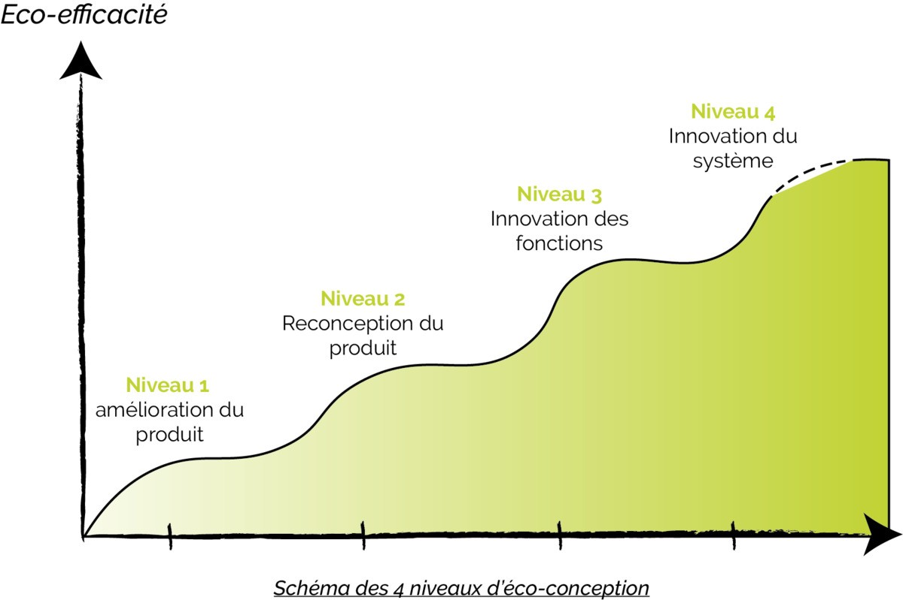

# Rapport d'écoconception & Déclaration environnementale (EIS) du site

<center>
<div style="width:200px">


</div>
</center>

> **Point d'attention** :
>
> Ceci n'est qu'un rapport de mesure, contenant des métriques permettant des optimisations dites de "Niveau 1/2". Il ne contient pas d'analyse ni de recommandations, hormis certaines bonnes pratiques référencées (la liste des bonnes pratiques est encore incomplète). Pour avoir des recommandations pour améliorer concrètement votre site, contactez un expert en écoconception, afin de réaliser des actions de niveau 3 à 4.



## Introduction

La mesure est effectuée avec l'outil Ecoindex, qui permet de mesurer l'impact environnemental d'un site web, en termes de consommation d'énergie et d'émission de gaz à effet de serre.

Chaque mesure de page est réalisée automatiquement par un robot qui réalise des actions de navigation standardisées.

<details>
<summary>Consulter le mode opératoire.</summary>
<br/>

```text
1. Lancez un navigateur Chrome sans tête avec les capacités no-sandbox, disable-dev-shm-usage et goog:loggingPrefs réglées sur {"performance" : "ALL"}.
2. Ouvrez la page sans données locales (cache, cookies, localstorage...) à une résolution de 1920 × 1080px.
3. Attendez 3 secondes
4. Faites défiler la page jusqu'en bas
5. Attendez encore 3 secondes
6. Fermer la page
```

</details>

Le cache navigateur est vide au premier chargement de page, mais est conservé pour les pages suivantes, afin de simuler le comportement d'un utilisateur.

## Contenu de cette archive

### 1. Rapports de mesures d'écoconception et des bonnes pratiques pour comprendre et améliorer votre note.

Des fichiers HTML et JSON sont disponibles pour chaque page mesurée et sont regroupées en parcours (même les 5 pages les plus consultées).

- ./\*.report.html (lisible dans un navigateur)
- ./\*.report.json

### 2. Rapports de déclaration environnementale (EIS) du site

> **Plus d'informations sur le site de la démarche : https://declaration.greenit.fr/**

Des documents standards, préremplies avec les informations de votre site, sont disponibles dans le dossier `./statements`.

- **Version HTML** : `./statements/ecoindex-environmental-statement.html`
- **Version MD** : `./statements/ecoindex-environmental-statement.md`
- **Version JSON** : `./statements/ecoindex-environmental-statement.json`

La version JSON du EIS doit être déposé à la racine du site, afin d'être consultable suivant cette URL type `https://domain.tld/ecoindex-environmental-statement.json` (domain.tld est à remplacer par votre nom de domain).

Les versions HTML ou MD sont là pour vous aider à les mettre à disposition des utilisateurs, dans le but de leur permettre de consulter le EIS de votre site.

Une fois votre déclaration en ligne, vous pouvez aussi la référencer sur le site de la démarche, afin de la rendre visible à tous en allant sur cette page https://declaration.greenit.fr/ressources/sites-evalues ou en replissant directement ce formulaire https://docs.google.com/forms/d/1FSH8BhmWDG6VKmnS1YZ95i_-CdB9o5c3Gobrbx7kzUw/viewform?ts=6486c0ac&edit_requested=true
